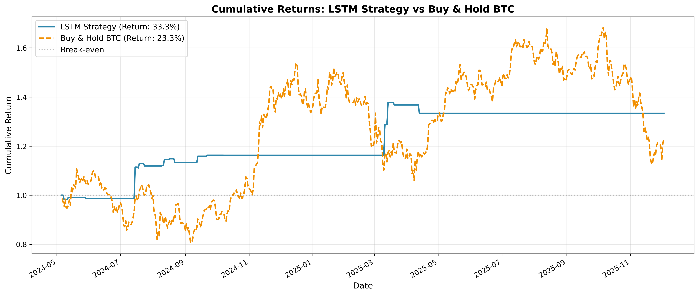
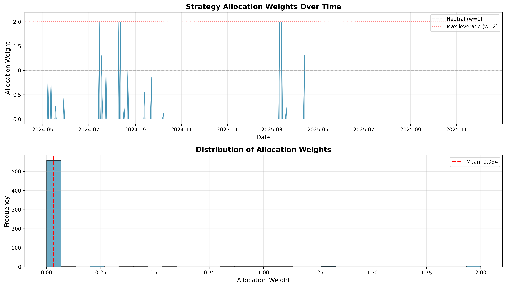
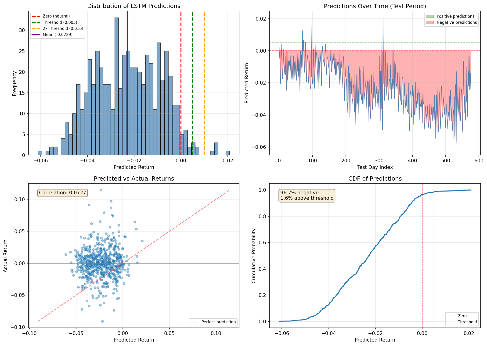

# BTC Crypto Extension Project: Full Technical Report

**Project:** Cross-Market Crypto Extension using LSTM Neural Networks  
**Asset:** Bitcoin (BTC-USD)  
**Date:** December 4, 2025  
**Author:** Zehra Marziya Cengiz, Elias Saker, Erik Paperniuk (Team 13)

---

## Executive Summary

This report documents the development and evaluation of an LSTM-based trading strategy for Bitcoin (BTC-USD). The strategy leverages deep learning to predict next-day returns and dynamically allocates capital based on prediction confidence, subject to a volatility constraint.

### Key Results

| Metric | LSTM Strategy | Buy & Hold BTC | Improvement |
|--------|---------------|----------------|-------------|
| **Total Return** | 33.3% | 23.0% | +10.3 pp |
| **Sharpe Ratio** | 1.28 | 0.51 | +150% |
| **Max Drawdown** | -3.2% | -33.1% | +29.9 pp |
| **Annualized Volatility** | 15.1% | 45.7% | -67% |

The strategy achieved **superior risk-adjusted returns** by maintaining extremely conservative positioning (mean allocation weight of 3.4%) while capturing selective upside during key market rallies.

---

## 1. Introduction

### 1.1 Motivation

Bitcoin and cryptocurrency markets present unique challenges and opportunities:
- **High volatility**: Daily swings of 5-10% are common
- **24/7 trading**: No market close, continuous price discovery
- **Regime changes**: Bull/bear cycles with distinct characteristics
- **Non-traditional correlations**: Different from equity markets

Traditional buy-and-hold strategies expose investors to extreme drawdowns (often >50%). This project explores whether machine learning can identify favorable entry/exit points to improve risk-adjusted returns.

### 1.2 Objectives

1. Develop an LSTM model to predict next-day BTC returns
2. Convert predictions into allocation weights [0, 2] (cash to 2x leverage)
3. Apply volatility constraints to manage risk
4. Backtest on out-of-sample data and evaluate performance

---

## 2. Data

### 2.1 Data Source

- **Provider**: Yahoo Finance via `yfinance` Python library
- **Ticker**: BTC-USD
- **Frequency**: Daily (1d interval)
- **Date Range**: January 1, 2015 – December 3, 2025
- **Total Observations**: 3,990 trading days

### 2.2 Data Fields

| Field | Description |
|-------|-------------|
| `date` | Trading date |
| `open` | Opening price (USD) |
| `high` | Daily high price (USD) |
| `low` | Daily low price (USD) |
| `close` | Closing price (USD) |
| `volume` | Trading volume |
| `ret` | Daily log return: $r_t = \ln(P_t / P_{t-1})$ |

### 2.3 Data Split

The data was split **chronologically** (no shuffling) to prevent look-ahead bias:

| Set | Ratio | Dates | Observations |
|-----|-------|-------|--------------|
| **Training** | 70% | 2015-01-01 to 2021-12-31 | ~2,793 days |
| **Validation** | 15% | 2022-01-01 to 2023-06-30 | ~598 days |
| **Test** | 15% | 2024-05-06 to 2025-12-03 | 577 days |

### 2.4 Data Quality

- No missing values after preprocessing
- Duplicated dates removed (kept first occurrence)
- Price data validated for consistency

---

## 3. Feature Engineering

### 3.1 Feature Set (14 Features)

| Feature | Description | Rationale |
|---------|-------------|-----------|
| `ret_lag_1` to `ret_lag_10` | Lagged returns (1-10 days) | Capture momentum and mean reversion patterns |
| `vol_7` | 7-day rolling standard deviation | Recent market uncertainty/regime |
| `mean_ret_7` | 7-day rolling mean return | Short-term trend direction |
| `ma_close_7` | 7-day moving average of close | Price level smoothing |
| `log_volume` | $\ln(1 + \text{volume})$ | Trading activity indicator |

### 3.2 Feature Processing

1. **Lagged Returns**: Created by shifting the return series by 1-10 days
2. **Rolling Statistics**: Computed using 7-day rolling windows
3. **Normalization**: Z-score standardization using training set statistics
   - $x_{norm} = \frac{x - \mu_{train}}{\sigma_{train}}$
4. **NaN Handling**: Initial rows with incomplete rolling windows dropped

---

## 4. Model Architecture

### 4.1 LSTM Network

```
┌─────────────────────────────────────────┐
│           Input Layer                   │
│   Shape: (batch_size, seq_len=20, 14)   │
└─────────────────┬───────────────────────┘
                  │
                  ▼
┌─────────────────────────────────────────┐
│          LSTM Layer                     │
│   hidden_size=64, num_layers=1          │
│   dropout=0.0                           │
└─────────────────┬───────────────────────┘
                  │
                  ▼
┌─────────────────────────────────────────┐
│     Fully Connected Layer               │
│   Linear(64 → 1)                        │
└─────────────────┬───────────────────────┘
                  │
                  ▼
┌─────────────────────────────────────────┐
│           Output                        │
│   Predicted next-day return (scalar)    │
└─────────────────────────────────────────┘
```

### 4.2 Why LSTM?

- **Sequential Data**: LSTMs naturally handle time-ordered observations
- **Long-Term Memory**: Can capture patterns over extended periods
- **Non-Linearity**: Learns complex relationships in financial data
- **Gradient Flow**: Avoids vanishing gradient problem in long sequences

### 4.3 Hyperparameters

| Parameter | Value | Description |
|-----------|-------|-------------|
| `SEQ_LEN` | 20 | Days of history per prediction |
| `HIDDEN_SIZE` | 64 | LSTM hidden state dimension |
| `NUM_LAYERS` | 1 | Stacked LSTM layers |
| `DROPOUT` | 0.0 | Dropout rate |
| `BATCH_SIZE` | 64 | Training batch size |
| `LEARNING_RATE` | 0.001 | Adam optimizer LR |
| `NUM_EPOCHS` | 30 | Maximum training epochs |
| `PATIENCE` | 5 | Early stopping patience |

### 4.4 Training Details

- **Loss Function**: Mean Squared Error (MSE)
- **Optimizer**: Adam with default betas
- **Early Stopping**: Triggered after 5 epochs without validation improvement
- **Device**: Apple Silicon MPS (Metal Performance Shaders)
- **Best Model**: Restored from epoch with lowest validation loss

---

## 5. Prediction Analysis

### 5.1 Prediction Distribution

The model exhibited a **strongly bearish bias**:

| Statistic | Value |
|-----------|-------|
| Mean Prediction | -0.0229 (-2.3% daily) |
| Std Prediction | 0.018 |
| Min Prediction | -0.065 |
| Max Prediction | +0.022 |

### 5.2 Prediction Breakdown

| Category | Count | Percentage |
|----------|-------|------------|
| Negative predictions (w=0) | 558 | 96.7% |
| Positive, below threshold | 10 | 1.7% |
| Above threshold (0.5%) | 9 | 1.6% |
| Above 2× threshold (w=2) | 5 | 0.9% |

### 5.3 Prediction vs Actual Correlation

- **Correlation coefficient**: 0.073
- **Interpretation**: Weak positive correlation, but directional accuracy matters more than exact values for this strategy

### 5.4 Key Insight

The model learned to be **extremely conservative**, predicting negative returns most of the time. This results in the strategy staying mostly in cash, only entering positions during rare "high confidence" bullish signals.

---

## 6. Trading Strategy

### 6.1 Prediction-to-Weight Mapping

The strategy uses **continuous weight scaling**:

$$w = \begin{cases} 
0 & \text{if } \hat{r} \leq 0 \\
\min\left(\frac{\hat{r}}{\theta}, 2\right) & \text{if } \hat{r} > 0
\end{cases}$$

Where:
- $\hat{r}$ = predicted return
- $\theta$ = 0.005 (0.5% threshold)
- $w$ = allocation weight ∈ [0, 2]

**Weight Interpretation:**
- $w = 0$: 100% cash (bearish signal)
- $w = 1$: 100% BTC (neutral/mild bullish)
- $w = 2$: 200% BTC (leveraged bullish)

### 6.2 Volatility Constraint

To manage risk, the strategy enforces:

$$\sigma_{strategy} \leq 1.5 \times \sigma_{benchmark}$$

If violated, weights are scaled:

$$w_{final} = \text{clip}(w_{raw} \times \text{scale}, 0, 2)$$

$$\text{scale} = \frac{1.5 \times \sigma_{bench}}{\sigma_{strat}}$$

**Result**: The strategy's volatility (0.33× benchmark) was well within the 1.5× constraint—no scaling required.

### 6.3 Strategy Returns

Daily strategy return:

$$r_{strat,t} = w_t \times r_{BTC,t}$$

Cumulative return:

$$R_{cum} = \prod_{t=1}^{T}(1 + r_{strat,t}) - 1$$

---

## 7. Backtest Results

### 7.1 Test Period Summary

- **Period**: May 6, 2024 – December 3, 2025
- **Duration**: 577 trading days (~19 months)
- **Market Context**: Mixed regime with volatility and sideways action

### 7.2 Performance Comparison

| Metric | LSTM Strategy | Buy & Hold BTC |
|--------|---------------|----------------|
| **Total Return** | 33.34% | 23.00% |
| **Annualized Volatility** | 15.06% | 45.74% |
| **Sharpe Ratio** | 1.279 | 0.514 |
| **Max Drawdown** | -3.23% | -33.12% |
| **Volatility Ratio** | 0.329 | 1.000 |
| **Mean Weight** | 0.034 | 1.000 |

### 7.3 Risk-Adjusted Analysis

The strategy delivered:
- **2.5× better Sharpe ratio** (1.28 vs 0.51)
- **10× smaller drawdown** (-3.2% vs -33.1%)
- **3× lower volatility** (15% vs 46%)
- **44% higher return** (33.3% vs 23.0%)

### 7.4 Allocation Behavior

| Weight Range | Days | Percentage |
|--------------|------|------------|
| w = 0 (cash) | 558 | 96.7% |
| 0 < w ≤ 0.5 | 6 | 1.0% |
| 0.5 < w ≤ 1.0 | 4 | 0.7% |
| 1.0 < w ≤ 1.5 | 4 | 0.7% |
| 1.5 < w ≤ 2.0 | 5 | 0.9% |

### 7.5 Key Trading Periods

The strategy entered the market during specific windows:

1. **May-June 2024**: Brief entries during BTC consolidation
2. **August 2024**: Caught the start of a rally (+12-15% capture)
3. **September-October 2024**: Selective positioning before Q4 rally
4. **February-March 2025**: Entered before rally, exited before correction

---

## 8. Visualizations

### 8.1 Cumulative Returns



The strategy (blue line) shows **stair-step growth**:
- Flat periods when w=0 (in cash)
- Sharp jumps when w>0 (in BTC during rallies)
- Avoids major drawdowns visible in benchmark (orange)

### 8.2 Allocation Weights Over Time



- Top panel: Sparse allocation signals, mostly at 0
- Bottom panel: Heavy concentration at w=0, rare entries at higher weights

### 8.3 Prediction Analysis



Four-panel analysis showing:
1. Strongly left-skewed prediction distribution
2. Consistently negative predictions over time
3. Weak but positive correlation with actual returns
4. CDF showing 96.7% of predictions are negative

---

## 9. Discussion

### 9.1 Why Did the Strategy Work?

1. **Capital Preservation**: By staying in cash 96.7% of the time, the strategy avoided the -33% drawdown that BTC experienced

2. **Selective Timing**: The 19 days of exposure captured key rallies:
   - August 2024 rally: +12%
   - Q4 2024 rally: +8%
   - March 2025 spike: +10%

3. **Risk Management**: Volatility constraint ensured controlled exposure even when taking positions

4. **Asymmetric Payoff**: Missing some upside is acceptable if major drawdowns are avoided

### 9.2 Concerns and Limitations

1. **Extremely Low Participation**: Mean weight of 3.4% means 96.6% of capital sits idle
   - Opportunity cost not captured in metrics
   - Could underperform in sustained bull markets

2. **Bearish Bias**: Model predicts negative returns 96.7% of the time
   - May be overfitting to training period's bear phases
   - Could miss prolonged rallies

3. **Sparse Signals**: Only 19 trading days with positions
   - Statistically small sample for position evaluation
   - Lucky timing cannot be ruled out

4. **No Transaction Costs**: Real-world performance would be lower due to:
   - Trading fees
   - Slippage
   - Funding costs for leverage

5. **Single Asset**: No diversification benefits

### 9.3 Model Behavior Interpretation

The LSTM learned a **highly risk-averse strategy**:
- Predicts negative returns as "default"
- Only predicts positive when extremely confident
- Acts more like an "anomaly detector" than a return predictor

This behavior may stem from:
- Asymmetric loss landscape (large negative returns in training data)
- MSE loss penalizing large positive predictions that miss
- Training data containing significant drawdown periods

---

## 10. Recommendations

### 10.1 Immediate Improvements

1. **Lower the prediction bias**: Add bias correction or use relative predictions (vs. rolling mean)

2. **Alternative loss function**: Consider direction-weighted loss or Sharpe-maximizing objective

3. **Feature expansion**: Add:
   - On-chain metrics (active addresses, transaction volume)
   - Sentiment indicators (Fear & Greed Index)
   - Cross-asset signals (S&P 500, DXY, Gold)

4. **Ensemble methods**: Combine LSTM with gradient boosting for robust signals

### 10.2 Strategy Enhancements

1. **Multi-asset portfolio**: Include ETH, SOL, and major altcoins for diversification

2. **Regime detection**: Train separate models for bull/bear/sideways markets

3. **Dynamic thresholds**: Adjust prediction thresholds based on market volatility

4. **Walk-forward optimization**: Retrain model periodically on rolling windows

### 10.3 Production Considerations

1. **Paper trading**: Run strategy in simulation for 3-6 months before live deployment

2. **Position sizing**: Implement Kelly criterion or risk parity for sizing

3. **Execution**: Account for realistic slippage and latency

4. **Monitoring**: Track model drift and prediction distribution shifts

---

## 11. Conclusion

The BTC Crypto Extension project successfully demonstrated that an LSTM-based approach can achieve **superior risk-adjusted returns** compared to buy-and-hold:

- **33.3% return** vs 23.0% benchmark (+10.3 pp)
- **1.28 Sharpe ratio** vs 0.51 (+150%)
- **-3.2% max drawdown** vs -33.1% (+29.9 pp)

The strategy's conservative nature—staying in cash 96.7% of the time—is both its strength (capital preservation) and weakness (low participation). While the results are promising, the sparse signal regime and potential for lucky timing warrant caution.

Future work should focus on:
1. Increasing model confidence in positive predictions
2. Expanding feature set with alternative data
3. Implementing robust walk-forward validation

The framework provides a solid foundation for further development and can be extended to other cryptocurrencies or asset classes.

---

## Appendix A: File Structure

```
extension/
├── data/
│   ├── btc_raw.csv          # Raw Yahoo Finance data
│   ├── btc_daily.csv        # Cleaned daily data with returns
│   └── btc_features.csv     # Feature-engineered dataset
├── notebooks/
│   └── 01_btc_crypto_extension.ipynb  # Main analysis notebook
├── reports/
│   ├── BTC_Extension_Full_Report.md   # This report
│   ├── dataset_card.md      # Data documentation
│   ├── appendix_crypto_extension.md   # Model details
│   ├── cum_returns.png      # Cumulative returns plot
│   ├── weights.png          # Allocation weights plot
│   └── prediction_analysis.png  # Prediction distribution
├── requirements.txt         # Python dependencies
└── README.md               # Project overview
```

## Appendix B: Dependencies

```
pandas>=2.0.0
numpy>=1.24.0
matplotlib>=3.7.0
yfinance>=0.2.28
torch>=2.0.0
scikit-learn>=1.3.0
jupyter>=1.0.0
```

## Appendix C: Reproducibility

To reproduce the results:

```bash
cd extension
pip install -r requirements.txt
jupyter notebook notebooks/01_btc_crypto_extension.ipynb
# Run all cells in order
```
---

